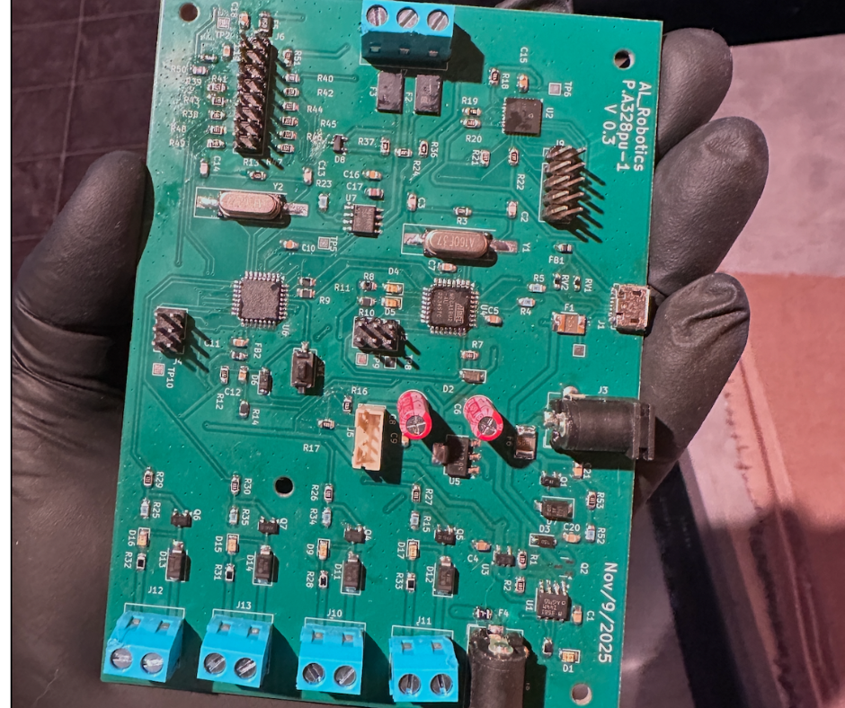
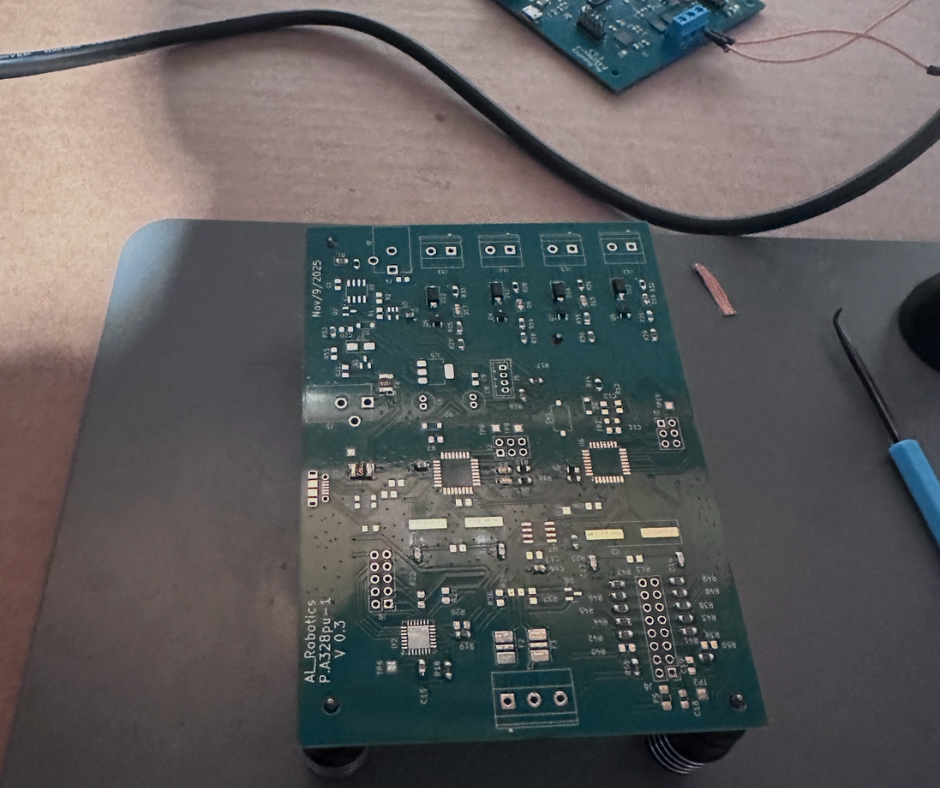
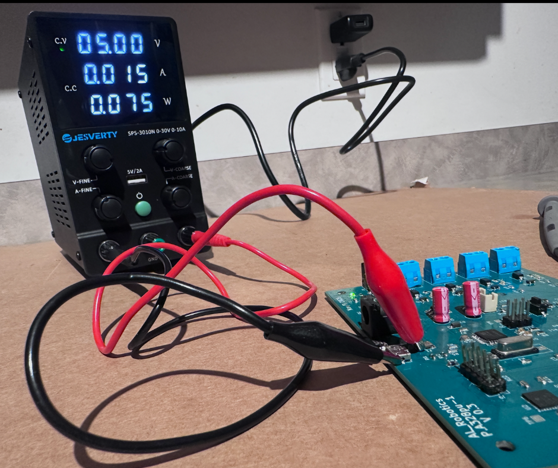
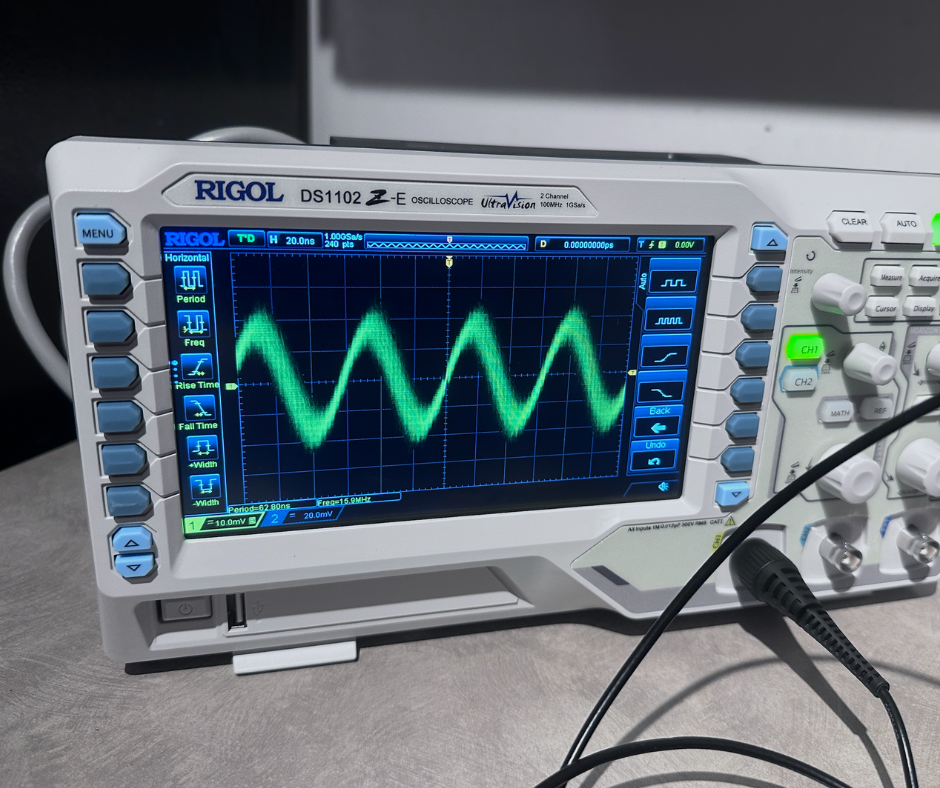
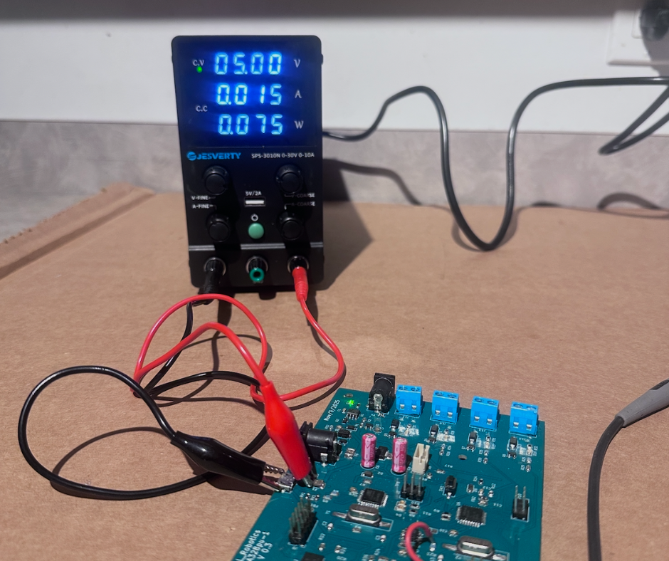

# ATmega328 Control Board

Custom embedded control board designed around the ATmega328PU microcontroller.

## Prototype Board

## Assembly

## Testing Setup

## Clock Verification
External 16 MHz crystal verified using oscilloscope.

## Power Testing
Board powered and tested using laboratory power supply.

### Features
- ATmega328PU microcontroller
- 16 MHz external crystal
- MOSFET output drivers
- Screw terminal IO
- USB programming interface
- External power supply

## Repository structure

hardware – KiCad PCB design  
firmware – Arduino firmware  
gerbers – manufacturing files  
bom – bill of materials  
docs – schematic PDF  
images – hardware prototype photos

## Hardware validation

Clock oscillator verified with oscilloscope.

Board powered and tested using laboratory power supply.

## Author

Oleksandr Surdushkin  
AL Robotics
